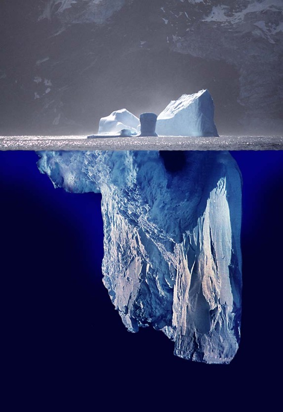

# Iceberg  (Version B) ##

### This version is to verify the hypothesis that an overview picture is more attractive.

An **iceberg** or **ice mountain** is a large piece of freshwater ice that has broken off a glacier or an ice shelf and is floating freely in open water. It may subsequently become frozen into pack ice (one form of sea ice). As it drifts into shallower waters, it may come into contact with the seabed, a process referred to as seabed gouging by ice.

   
